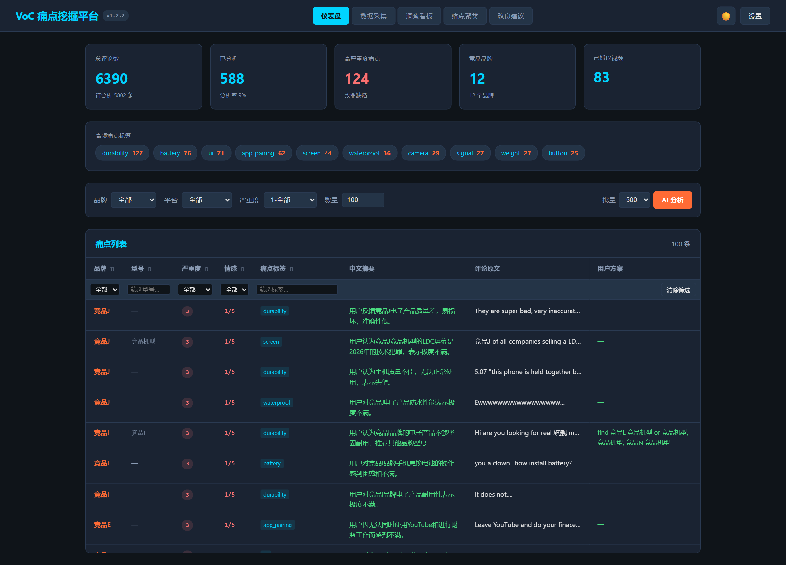
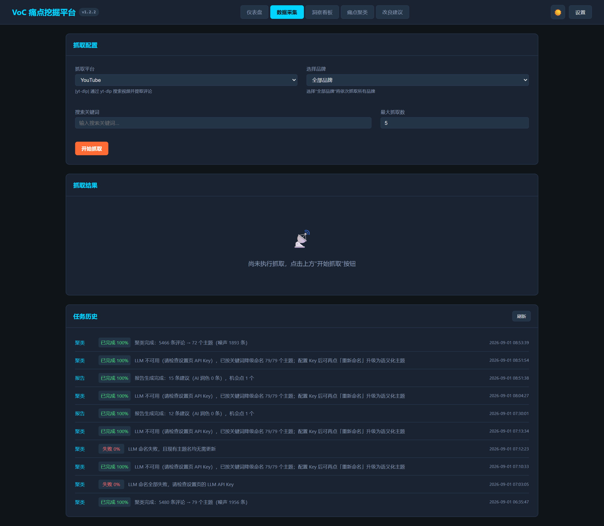
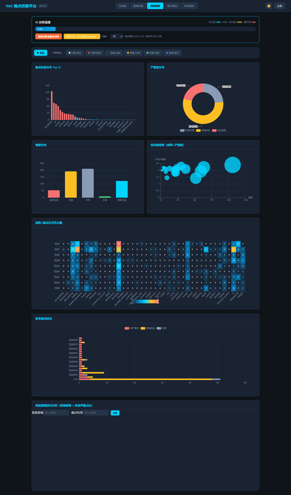
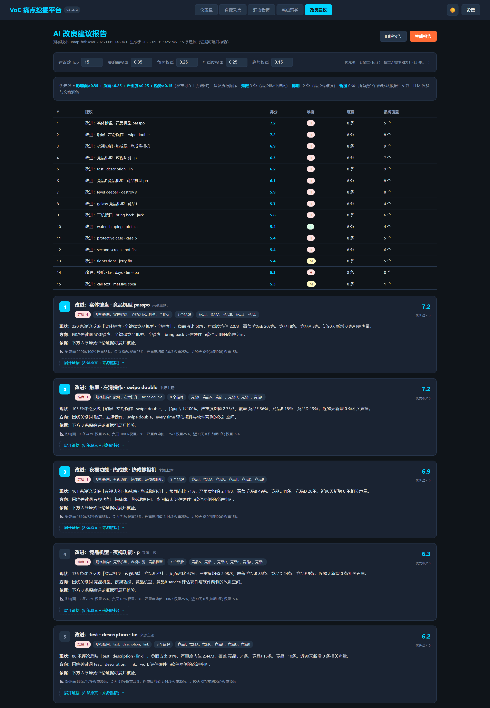

# VoC 痛点挖掘平台

> 自动化竞品社媒评论抓取 + AI 痛点结构化分析 + 产品改良建议生成


**VoC 痛点挖掘平台** 是一款面向消费电子产品赛道的桌面应用，由 RugOne 团队开发。平台自动从海外社交媒体抓取竞品产品评论，借助多 LLM 完成结构化痛点提取，并通过可视化看板与 AI 报告输出可落地的产品改良建议。

目标竞品：海外市场主流消费电子产品品牌，品牌列表支持在应用内自定义增删。

> **v1.2.2（2026-09-02）**：证据链 / 簇内评论支持一键 AI 中文翻译（外文评论下方显示译文，结果永久缓存，全站复用）。
> **v1.2.1（2026-09-02）**：版本号显示统一（单一来源 version.py）+ 桌面精简版外部聚类依赖接入（设置页指定 site-packages 目录即可重跑聚类）。
> **v1.2.0（2026-09-01）— v2.0 升级 Phase 1+2 交付**：新增评论质量过滤引擎（含链接垃圾/导购评论拦截）、AliExpress 电商评论接入、全局痛点聚类（BGE-M3 多语言向量化 + UMAP/HDBSCAN，79 个主题簇、簇中文命名）、「痛点聚类」页面；GLM 新增 glm-5.2/5.3；LLM 429 限流诊断细化。发布目录 `release-v1.2/`，全量变更见 [CHANGELOG.md](./CHANGELOG.md)。

---

## 目录

- [系统流程](#-系统流程)
- [功能特性](#-功能特性)
- [界面截图](#-界面截图)
- [技术栈](#-技术栈)
- [快速开始](#-快速开始)
- [使用指南](#-使用指南)
- [LLM 配置](#-llm-配置)
- [项目结构](#-项目结构)
- [数据库设计](#-数据库设计)
- [API 文档](#-api-文档)
- [从源码构建](#-从源码构建)
- [平台支持](#-平台支持)
- [贡献指南](#-贡献指南)
- [开源协议](#-开源协议)
- [版本变更记录](./CHANGELOG.md)

---

## 系统流程

```
┌─────────────────────────────────────────────────────────────────────┐
│                        VoC 痛点挖掘平台                              │
├──────────────┬──────────────────┬────────────────┬──────────────────┤
│  第一层       │  第二层           │  第三层         │  第四层           │
│  数据采集     │  AI 分析          │  存储与检索      │  洞察输出         │
├──────────────┼──────────────────┼────────────────┼──────────────────┤
│              │                  │                │                  │
│  YouTube     │  Gemini          │                │  ECharts 可视化   │
│  (yt-dlp)    │  DeepSeek        │  SQLite        │  - 标签分布       │
│              │                  │  (7 张表)       │  - 严重度饼图     │
│  Reddit      │  GLM (智谱)       │                │  - 优先级矩阵     │
│  (JSON+RSS)  │                  │  brands        │  - 品牌热力图     │
│              │  Kimi (月之暗面)   │  products      │                  │
│  Instagram   │                  │  videos        │  AI 改良报告       │
│  (Instaloader)│  通义千问 (阿里)  │  comments      │  - 高频痛点改良   │
│              │                  │  analyses      │  - 竞品差距分析   │
│  TikTok      │  统一 OpenAI 接口  │  settings/jobs │  - 微创新机会     │
│  (元数据)     │                  │                │  - 优先级 Top 10  │
│              │                  │                │                  │
└──────────────┴──────────────────┴────────────────┴──────────────────┘
     抓取                结构化分析          持久化存储         可视化与报告
```

---

## 功能特性

- **多平台数据采集**：YouTube、Reddit、Instagram、AliExpress 采用各自公开抓取引擎，TikTok 支持视频元数据；实际可用性受平台登录、地区网络和反爬策略影响
- **评论质量过滤引擎**：落盘前规则闸门（长度下限、纯表情、纯链接、链接垃圾/导购话术、按平台点赞阈值、楼中楼深度标记），被过滤评论仅标记不删除，阈值可在设置页调整并一键全量重算
- **全局痛点聚类**：BGE-M3 多语言向量化（本地缓存增量计算）+ UMAP 降维 + HDBSCAN 聚类，自动产出主题簇；LLM 语义命名 + 无 Key 时中文词库降级命名；支持全量 / 增量归簇 / 重新命名三种模式
- **多 LLM 痛点分析**：接入 5 家大模型提供商（Gemini / DeepSeek / GLM / Kimi / 通义千问），统一 OpenAI 兼容接口，一键切换
- **结构化痛点提取**：每条评论自动提取情感分、痛点类别、痛点标签、严重度、用户建议、匹配型号、中文摘要
- **品牌维度管理**：内置 5 大竞品品牌，支持增删改查，评论按品牌分组浏览
- **可视化洞察看板**：基于 ECharts 的 6 类图表（标签分布、严重度饼图、情感分布、优先级矩阵、品牌热力图、型号排名）
- **AI 改良报告**：LLM 自动生成包含高频痛点改良、竞品差距分析、微创新机会、优先级清单的产品建议报告
- **报告导出**：支持将 AI 改良报告导出为 HTML 文件（保留主题样式）或通过浏览器打印另存为 PDF，方便分享与存档
- **桌面应用体验**：pywebview 封装原生窗口，双击 exe 即用，无需安装 Python 环境
- **明暗主题切换**：支持浅色 / 深色主题，localStorage 持久化偏好
- **痛点表格交互**：表头筛选（型号、严重度、情感、标签）+ 列排序（严重度、情感、点赞数）
- **来源溯源链接**：视频、帖子和评论保留公开来源 URL，分析详情可回到原始内容
- **真实任务状态**：后台任务区分排队、运行、成功、无匹配结果、失败和取消；网络/解析异常不会再伪装为成功
- **批量轮询分析**：默认每批 500 条，多品牌轮询分配，确保各品牌公平覆盖
- **安全容错机制**：60 秒 LLM 请求超时 + 禁用自动重试 + 认证失败即时停止并提示

---

## 界面截图

> 以下为平台四个主标签页的界面示意，实际界面请运行应用后查看。

### 仪表盘


*统计卡片 + 痛点标签排行 + 痛点列表（支持表头筛选与排序）*

### 数据采集


*平台选择 + 品牌选择 + 关键词输入 + 抓取进度 + 历史结果*

### 洞察看板


*6 类 ECharts 可视化图表，多维交叉分析*

### 改良建议


*AI 生成的 Markdown 格式改良报告，4 大板块，支持导出 HTML / PDF*

---

## 技术栈

| 层级 | 技术 | 说明 |
|------|------|------|
| **后端框架** | FastAPI + Uvicorn | 高性能异步 Web 框架，提供全部 REST API |
| **前端界面** | 原生 HTML + ECharts + Marked.js | 单页应用，4 个标签页，ECharts 负责可视化，Marked.js 渲染 Markdown 报告 |
| **桌面封装** | pywebview | 将 Web UI 封装为原生桌面窗口，跨平台支持 |
| **数据库** | SQLite | 轻量级嵌入式数据库，7 张表（含 jobs），WAL 模式 |
| **视频抓取** | yt-dlp | YouTube / TikTok 视频搜索与评论提取 |
| **Reddit 抓取** | requests + JSON API / RSS fallback | 逐品牌搜索、失败透传；匿名端点可能受登录、地区和 403 限制 |
| **Instagram 抓取** | Instaloader | 按 hashtag 搜索帖子并提取评论 |
| **AI 分析** | OpenAI SDK | 兼容多家 LLM 提供商，统一接口调用 |
| **语言检测** | langdetect | 自动识别评论语言 |
| **打包工具** | PyInstaller | 打包为单文件 `VoC-Platform.exe` |

---

## 快速开始

### 方式一：下载可执行文件（推荐非开发者使用）

1. 获取完整的 `release-v1.2/` 目录（不要混用旧 `dist-*` 或历史 release 目录）
2. 双击 `release-v1.2/VoC-Platform.exe`，无需安装 Python 或任何依赖
3. 首次启动后，进入设置页面配置 LLM 提供商和 API Key

> 正式数据保存在 `%LOCALAPPDATA%\VoC-Platform\data\voc.db`。仅当该文件不存在时，程序才会从发布目录的 `data/voc.db` 复制历史数据；已有数据库绝不会被覆盖。可用 `VOC_DATA_DIR` 覆盖数据目录，主要用于测试和故障排查。

> **桌面版重跑聚类（可选）**：EXE 精简版不内置约 1GB 的聚类科学计算栈（torch / umap / hdbscan），查看簇与 AI 重命名开箱即用；如需在桌面版重跑聚类，在「设置 → 聚类依赖目录（桌面版）」填入已安装聚类依赖的 site-packages 目录（如源码模式 `.venv\Lib\site-packages`），点「测试」通过后保存即可，无需切换源码模式。要求该目录的 Python 版本与 EXE 一致（Python 3.12 / cp312）。

### 方式二：从源码运行（开发者）

**环境要求**：Windows x64 + Python 3.12 x64

```bash
# 1. 克隆项目
git clone <仓库地址>
cd voc-platform

# 2. 创建虚拟环境（推荐）
python -m venv .venv
.venv\Scripts\activate        # Windows
# source .venv/bin/activate   # macOS / Linux

# 3. 安装依赖
pip install -r requirements.txt

# 4. 配置环境变量（可选，也可在应用内设置页面配置）
cp .env.example .env
# 编辑 .env 填入 GEMINI_API_KEY

# 5. 启动桌面应用
python app.py
```

> 桌面应用每次启动都会选择独立的随机本机端口，并通过版本号和实例 token 校验后端，避免误连旧进程。开发时也可单独启动固定 8000 端口的后端：
> ```bash
> python main.py
> ```

---

## 使用指南

启动应用后，顶部导航栏提供 5 个功能标签页：

### 1. 仪表盘

平台的核心总览页面，一屏掌握全局数据。

- **统计卡片**：总评论数、已分析数、品牌数、视频数、高严重度痛点数，卡片可点击跳转
- **痛点标签 Top 榜**：展示高频痛点标签排行
- **痛点列表表格**：
  - 表头筛选：按型号、严重度、情感、标签组合过滤
  - 列排序：支持按严重度、情感分、点赞数排序
  - 点击展开分析详情弹窗，查看完整结构化分析结果
  - 支持跳转原始 YouTube 评论链接

### 2. 数据采集

从海外社媒平台抓取竞品评论。

- **平台选择**：YouTube / Reddit / Instagram / TikTok（4 选 1）
- **品牌选择**：下拉菜单自动同步设置中的品牌列表
- **搜索关键词**：预填品牌默认关键词，可自定义修改
- **最大抓取数**：设置每个品牌抓取的视频/帖子数量上限
- **抓取按钮**：点击开始抓取，实时显示进度
- **结果与历史**：展示视频数、评论数、新增数及明确的成功/无匹配/失败状态；失败记录保留阶段和错误详情

### 3. 洞察看板

多维可视化分析，发现痛点规律。

| 图表 | 类型 | 说明 |
|------|------|------|
| 痛点标签分布 | 柱状图（Top 15） | 各痛点标签的提及频次，含严重度细分 |
| 严重度分布 | 饼图 | 轻微吐槽 / 影响体验 / 致命缺陷 占比 |
| 情感分布 | 饼图 | 极度负面 ~ 极度正面 5 级情感占比 |
| 优先级矩阵 | 散点图 | 痛点频率 × 平均严重度，四象限定位 |
| 品牌 × 痛点热力图 | 热力图 | 各品牌在各痛点维度的集中度 |
| 型号痛点排名 | 柱状图 | 按高严重度痛点数排序的产品型号 |

### 4. 痛点聚类

将全量评论自动聚成主题簇，从"逐条分析"升级为"主题洞察"。

- **聚类参数**：最小簇规模（默认 10）、归簇阈值（增量模式）
- **三种运行模式**：
  - **全量聚类**：重新执行 embedding（增量缓存）→ UMAP → HDBSCAN → 命名
  - **增量归簇**：新评论向已有簇归并，不重跑全量
  - **重新命名**：仅对现有簇重新执行 LLM 命名（配置 Key 后一键升级语义化主题名）
- **簇卡片**：主题名（LLM 语义命名 / 中文词库降级命名）、评论数、平均严重度、平均情感、关键词标签、簇内评论钻取
- **LLM 不可用时**：自动降级为关键词命名并翻译为中文（内置电子产品领域词库，品牌/型号保留英文）

### 5. 改良建议

AI 自动生成产品改良报告。

点击「生成报告」按钮后，后端汇总痛点数据并调用 LLM 生成 Markdown 报告，包含 4 大板块：

- **一、高频痛点改良建议**：针对 Top 5 高频痛点，给出痛点描述、影响范围、改良方向、优先级（P0/P1/P2）
- **二、竞品差距分析**：各品牌在痛点维度的差异对比，找出需改进项与可借鉴项
- **三、微创新机会**：从用户评论中提炼可执行的微创新点，附用户原话依据和实现难度
- **四、改良优先级清单**：综合频率 × 严重度 × 用户需求，输出 Top 10 改良优先级

报告生成后，标题栏右侧会出现两个导出按钮：

- **导出 HTML**：将完整报告（含样式、表格、排版）打包为独立 HTML 文件下载，文件名自动带日期，可离线打开或转发
- **导出 PDF**：在新窗口中打开报告并调用浏览器打印对话框，选择「另存为 PDF」即可生成 PDF 文件；导出内容会自动切换为适合打印的浅色排版

> 导出的报告保留当前主题（浅色/深色）样式，文件名格式为 `VoC改良建议报告_YYYY-MM-DD.html`。

---

## LLM 配置

平台支持 5 家大模型提供商，全部通过 OpenAI 兼容接口接入，在应用内设置页面即可完成配置。

### 配置步骤

1. 打开应用，进入「设置」页面
2. 选择 LLM 提供商（5 选 1）
3. 填入对应提供商的 API Key
4. 选择模型（可选，留空则使用默认模型）
5. 点击「测试连接」验证配置是否有效
6. 保存配置

> 配置信息加密存储在 SQLite 数据库 `settings` 表中，API Key 在前端展示时自动脱敏。

### 支持的 LLM 提供商

| 提供商 | 默认模型 | 可选模型 | API Key 获取地址 |
|--------|----------|----------|-----------------|
| **Gemini** (Google) | `gemini-2.5-flash` | `gemini-2.5-flash`、`gemini-2.5-pro`、`gemini-1.5-flash` | https://aistudio.google.com/apikey |
| **DeepSeek** (深度求索) | `deepseek-chat` | `deepseek-chat`、`deepseek-reasoner` | https://platform.deepseek.com/api_keys |
| **GLM** (智谱清言) | `glm-4-flash` | `glm-5.3`、`glm-5.2`、`glm-4-flash`、`glm-4`、`glm-4-air` | https://open.bigmodel.cn/usercenter/apikeys |
| **Kimi** (月之暗面) | `moonshot-v1-8k` | `moonshot-v1-8k`、`moonshot-v1-32k`、`moonshot-v1-128k` | https://platform.moonshot.cn/console/api-keys |
| **通义千问** (阿里) | `qwen-turbo` | `qwen-turbo`、`qwen-plus`、`qwen-max` | https://dashscope.console.aliyun.com/apiKey |

> **提示**：推荐使用 Gemini（免费额度较多）或 DeepSeek（性价比高）。Kimi 的 128k 模型适合长文本分析场景。

---

## 项目结构

```
voc-platform/
├── app.py                  # 桌面应用入口（pywebview 窗口 + 内嵌 FastAPI 服务）
├── version.py              # 统一应用版本、产品名和数据库结构版本
├── main.py                 # FastAPI 主应用，定义全部 API 端点
├── config.py               # 全局配置管理（数据库路径、API Key、抓取参数等）
├── database.py             # SQLite 数据库层（建表、增删改查、洞察聚合查询）
├── crawler.py              # 多平台评论抓取调度（YouTube / Reddit / Instagram / TikTok / AliExpress）
├── sources/                # 平台抓取模块（共享文本工具 + 各平台适配）
│   ├── common.py           #   清洗/语言检测/CJK 长度等共享工具
│   └── quality_filter.py   #   评论质量过滤引擎（可配置规则闸门）
├── analyzer.py             # LLM 痛点分析模块（Prompt 构建 + 批量分析 + 结果解析）
├── advisor.py              # AI 改良建议报告生成与证据链组织
├── clustering.py           # 痛点聚类引擎（BGE-M3 embedding 缓存 + UMAP + HDBSCAN + 簇命名）
├── llm_provider.py         # 多 LLM 提供商抽象层（统一 OpenAI 兼容接口）
├── static/
│   └── index.html          # 前端单页应用（5 个标签页 + ECharts + Marked.js）
├── data/
│   └── voc.db              # 源码模式及发布种子数据库
├── tests/
│   └── test_smoke.py       # 依赖、健康接口、数据库及抓取状态回归测试
├── release-v1.2/
│   ├── VoC-Platform.exe    # 唯一对外交付的 v1.2 可执行文件
│   └── data/voc.db         # 首次启动使用的历史数据种子
├── voc-platform.spec       # PyInstaller 打包配置文件
├── requirements.txt        # Python 依赖清单
├── .env.example            # 环境变量配置模板
├── app_icon.ico            # 应用图标
├── LICENSE                 # MIT 开源协议
├── CHANGELOG.md            # 版本变更记录
└── README.md               # 项目说明文档（本文件）
```

---

## 数据库设计

数据库使用 SQLite，共 13 张表（v2.0 升级后新增 `clusters` 痛点簇表、`embeddings` 向量缓存表等）。源码模式默认路径为项目内 `data/voc.db`；打包版正式路径为 `%LOCALAPPDATA%\VoC-Platform\data\voc.db`。

### 1. brands — 品牌表

| 字段 | 类型 | 说明 |
|------|------|------|
| `id` | TEXT (PK) | 品牌 ID（UUID） |
| `name` | TEXT (UNIQUE) | 品牌名称 |
| `search_keyword` | TEXT | 默认搜索关键词 |
| `created_at` | TEXT | 创建时间 |

`brand_type` 标记 `competitor`、`own` 或后续 benchmark 类型。

### 2. products — 产品表

| 字段 | 类型 | 说明 |
|------|------|------|
| `id` | TEXT (PK) | 产品 ID（UUID） |
| `brand_id` | TEXT (FK) | 关联品牌 ID |
| `model` | TEXT | 产品型号 |
| `aliases` | TEXT | 型号别名（JSON） |
| `created_at` | TEXT | 创建时间 |

### 3. videos — 视频/帖子表

| 字段 | 类型 | 说明 |
|------|------|------|
| `id` | TEXT (PK) | 记录 ID（UUID） |
| `video_id` | TEXT (UNIQUE) | 平台视频/帖子 ID |
| `platform` | TEXT | 来源平台 |
| `external_id` | TEXT | 平台原始视频/帖子 ID |
| `title` | TEXT | 标题 |
| `channel` | TEXT | 频道/作者 |
| `view_count` | INTEGER | 播放/浏览量 |
| `comment_count` | INTEGER | 评论数 |
| `published_at` | TEXT | 发布时间 |
| `crawled_at` | TEXT | 抓取时间 |
| `source_url` | TEXT | 可回溯的公开来源链接 |
| `brand_id` | TEXT (FK) | 关联品牌 ID |

### 4. comments — 评论表

| 字段 | 类型 | 说明 |
|------|------|------|
| `id` | TEXT (PK) | 评论 ID（UUID） |
| `platform` | TEXT | 来源平台（youtube/reddit/instagram/tiktok） |
| `original_id` | TEXT | 平台原始评论 ID |
| `video_id` | TEXT (FK) | 关联视频/帖子 ID |
| `brand_id` | TEXT (FK) | 关联品牌 ID |
| `content` | TEXT | 原始评论内容 |
| `content_clean` | TEXT | 清洗后内容 |
| `language` | TEXT | 语言代码（如 en、zh） |
| `author` | TEXT | 评论作者 |
| `like_count` | INTEGER | 点赞数 |
| `posted_at` | TEXT | 评论发布时间 |
| `source_url` | TEXT | 评论或所属帖子来源链接 |
| `crawled_at` | TEXT | 抓取时间 |
| `sentiment_pre` | INTEGER | 预判情感分 |
| `analyzed` | INTEGER | 是否已分析（0=未分析，1=已分析） |

### 5. analyses — 分析结果表

| 字段 | 类型 | 说明 |
|------|------|------|
| `id` | TEXT (PK) | 分析 ID（UUID） |
| `comment_id` | TEXT (FK, UNIQUE) | 关联评论 ID |
| `sentiment_score` | INTEGER | 情感分（1=极度负面 ~ 5=极度正面） |
| `pain_categories` | TEXT | 痛点类别（JSON 数组：hardware/software/scenario/ecosystem） |
| `pain_tags` | TEXT | 痛点标签（JSON 数组：battery/screen/waterproof 等） |
| `severity` | INTEGER | 严重度（1=轻微吐槽，2=影响体验，3=致命缺陷） |
| `user_solution` | TEXT | 用户提出的改良建议 |
| `product_match` | TEXT | 匹配的产品型号 |
| `summary_zh` | TEXT | 50 字中文摘要 |
| `translation_zh` | TEXT | 评论中文翻译 |
| `confidence` | REAL | AI 结构化判断置信度（0-1） |
| `llm_model` | TEXT | 使用的 LLM 模型 |
| `prompt_version` | TEXT | Prompt 版本 |
| `analyzed_at` | TEXT | 分析时间 |
| `human_corrected` | INTEGER | 是否人工修正（0=否，1=是） |

### 6. settings — 配置表

| 字段 | 类型 | 说明 |
|------|------|------|
| `key` | TEXT (PK) | 配置键名 |
| `value` | TEXT | 配置值 |
| `updated_at` | TEXT | 更新时间 |

> settings 表存储 LLM 提供商选择、各提供商的 API Key、模型选择等配置。Windows 单机版优先使用 DPAPI 加密 API Key；旧明文 Key 会继续兼容读取。

### 7. jobs — 后台任务表

保存抓取/分析任务的参数、状态、进度、错误和 JSON 结果；用于单机版轮询、取消和重启恢复。

### 异步任务与本地数据

抓取和 AI 分析均在后台线程执行，接口立即返回 `job_id`，前端会显示进度并保留任务历史。任务参数、状态、错误和结果保存在 SQLite 的 `jobs` 表中；抓取任务明确区分 `succeeded`、`empty`、`failed` 与 `cancelled`。所有评论、分析、来源链接和设置默认仅保存在本机数据库。

---

## API 文档

桌面模式的后端仅监听 `127.0.0.1` 的随机可用端口，并使用实例 token 校验；源码单独运行 `main.py` 时默认使用 `http://127.0.0.1:8000`。主要 REST API 如下：

### 页面

| 方法 | 路径 | 说明 |
|------|------|------|
| GET | `/` | 主页面（返回 index.html） |

### 数据统计与查询

| 方法 | 路径 | 参数 | 说明 |
|------|------|------|------|
| GET | `/api/stats` | — | 获取全局统计数据（评论数、分析数、品牌数等） |
| GET | `/api/pain-points` | `brand`, `platform`, `min_severity`, `limit` | 获取痛点列表（已分析评论 + 分析结果） |
| GET | `/api/comments` | `analyzed`, `brand`, `limit`, `offset` | 获取评论列表（支持分页） |
| GET | `/api/comments/grouped` | — | 获取按品牌分组的评论统计 + 每组前 5 条 |
| GET | `/api/analyses` | `brand`, `min_severity`, `limit`, `offset` | 获取分析结果详情（含评论原文） |
| GET | `/api/analyses/{comment_id}` | — | 获取单条分析及人工修正状态 |
| PUT | `/api/analyses/{comment_id}` | Body: `AnalysisUpdateModel` | 保存人工修正结果 |

### LLM 配置

| 方法 | 路径 | 参数 | 说明 |
|------|------|------|------|
| GET | `/api/llm/providers` | — | 获取所有支持的 LLM 提供商列表 |
| GET | `/api/llm/config` | — | 获取当前 LLM 配置（API Key 脱敏） |
| POST | `/api/llm/config` | Body: `LLMConfigModel` | 保存 LLM 配置 |
| POST | `/api/llm/test` | Body: `TestConnectionModel` | 测试 LLM 连接是否可用 |

### 品牌管理

| 方法 | 路径 | 参数 | 说明 |
|------|------|------|------|
| GET | `/api/brands` | — | 获取所有品牌（含评论数、分析数统计） |
| POST | `/api/brands` | Body: `BrandModel` | 添加品牌 |
| PUT | `/api/brands/{id}` | Body: `BrandModel` | 修改品牌信息 |
| DELETE | `/api/brands/{id}` | — | 删除品牌及其关联数据 |

### 数据抓取与分析

| 方法 | 路径 | 参数 | 说明 |
|------|------|------|------|
| GET | `/api/platforms` | — | 获取支持的平台列表及能力说明 |
| POST | `/api/crawl` | `brand_name`, `search_keyword`, `max_videos`, `platform` | 创建异步评论抓取任务，返回 `job_id` |
| POST | `/api/analyze` | `limit`, `brand` | 创建异步 AI 痛点分析任务，返回 `job_id` |
| GET | `/api/jobs` | `limit` | 获取本地任务历史 |
| GET | `/api/jobs/{job_id}` | — | 查询任务状态、进度和结果 |
| POST | `/api/jobs/{job_id}/cancel` | — | 请求取消排队中/运行中的任务 |
| GET | `/api/health` | — | 返回状态、应用版本、结构版本、实例 token、数据库路径和 jiter 原生运行时状态 |

### 评论质量过滤

| 方法 | 路径 | 说明 |
|------|------|------|
| GET | `/api/filter/config` | 获取质量过滤规则配置（阈值、开关、按平台点赞下限） |
| POST | `/api/filter/config` | 保存过滤规则配置 |
| POST | `/api/filter/recompute` | 按当前配置对全量评论一键重算过滤状态 |

### 痛点聚类

| 方法 | 路径 | 说明 |
|------|------|------|
| POST | `/api/cluster/run` | 创建聚类任务（mode: `full` 全量 / `incremental` 增量归簇 / `rename` 重新命名） |
| GET | `/api/clusters` | 获取当前活跃版本的簇列表（主题名、规模、严重度、情感、关键词） |
| GET | `/api/clusters/{cluster_id}/comments` | 获取簇内评论（钻取证据链） |

### 洞察可视化

| 方法 | 路径 | 说明 |
|------|------|------|
| GET | `/api/insights/tag-distribution` | 痛点标签分布（含严重度细分） |
| GET | `/api/insights/brand-tag-matrix` | 品牌 × 痛点交叉矩阵（热力图数据） |
| GET | `/api/insights/model-ranking` | 型号痛点排名 |
| GET | `/api/insights/priority-matrix` | 优先级矩阵（频率 × 严重度） |
| GET | `/api/insights/severity-distribution` | 严重度分布（饼图数据） |
| GET | `/api/insights/sentiment-distribution` | 情感分布（饼图数据） |
| GET | `/api/insights/summary` | 痛点数据汇总（报告生成数据源） |

### AI 报告

| 方法 | 路径 | 说明 |
|------|------|------|
| POST | `/api/insights/generate-report` | 调用 LLM 生成产品改良建议报告 |

---

## 从源码构建

v1.2 使用 Python 3.12 x64 与 PyInstaller 6.21.0 构建：

### 1. 安装打包依赖

```bash
pip install -r requirements.txt
```

### 2. 执行打包

```bash
# 使用独立目录，避免覆盖旧发布包（不要加 --clean，会连带清空全局 PyInstaller 缓存）
python -m PyInstaller --noconfirm --distpath .\dist-v1.2 --workpath .\build-v1.2 .\voc-platform.spec
```

### 3. 组装发布目录并验证

```bash
# 把 exe 复制到 release-v1.2/，并放入种子库 data/voc.db（当前活库副本）
# 然后跑无头自检，确认版本、依赖、静态资源、种子数据全部就绪：
release-v1.2\VoC-Platform.exe --self-test
```

### 4. 获取产物

打包完成后，可执行文件位于：

```
dist-v1.2/VoC-Platform.exe
```

### 打包说明

`voc-platform.spec` 配置要点：

- 入口文件：`app.py`
- 打包含：FastAPI 后端 + pywebview 窗口 + yt-dlp + Instaloader + OpenAI SDK
- 原生扩展：显式收集 `jiter.cp312` 与 `pydantic_core.cp312`
- 静态资源：`static/` 目录随 exe 打包
- 图标：`app_icon.ico`
- 排除项：matplotlib、numpy、pandas、tkinter 等不必要的大型库，以及聚类科学计算栈（torch / sentence-transformers / umap / hdbscan，约 1GB+）——桌面精简版保持约 44MB，查看簇与 AI 重命名可用，重跑聚类可在设置页接入外部依赖目录（见上文说明）或使用源码模式
- UPX 压缩：启用，减小体积

> 正式交付目录为 `release-v1.2/`，其中同时放置 EXE 与 `data/voc.db` 种子库。打包后必须执行 `VoC-Platform.exe --self-test`，并核对历史数据统计。

---

## 平台支持

| 平台 | 搜索 | 评论抓取 | 抓取引擎 | 说明 |
|------|:----:|:--------:|----------|------|
| **YouTube** | 条件支持 | 条件支持 | yt-dlp | 公开页面 best-effort；受地区网络、Cookie 和平台策略影响 |
| **Reddit** | 条件支持 | 条件支持 | OAuth + JSON API + RSS fallback | OAuth 应用认证，限流头解析 + 429 指数退避；评论保留楼中楼血缘 |
| **Instagram** | 条件支持 | 条件支持 | Instaloader | 按 hashtag 抓取；部分内容要求登录且可能触发 401/429 |
| **AliExpress** | 支持 | 支持 | 公开商品评论接口 | 电商评论接入，入库时执行质量过滤 |
| **TikTok** | 支持 | 不支持 | yt-dlp | 仅抓取视频元数据，评论暂不支持 |

### v0.8 发布验证

- 自动化烟测：7 项通过（原生依赖、健康接口、数据库和抓取任务状态）
- EXE 自检：`jiter`、`pydantic_core`、静态资源和 SQLite 全部通过
- 内置数据：6390 条评论、588 条分析、12 个品牌、83 个视频/帖子
- EXE 大小约 31.1 MB；SHA-256：`6012A3ADC1CFFECB09D444EF6B96014E8FFA117018A901EAC83FEB0C17CA7D49`

### 痛点分析维度

AI 分析时会从每条评论中提取以下结构化信息：

**痛点类别（pain_categories）**：

| 类别 | 说明 |
|------|------|
| `hardware` | 硬件问题 |
| `software` | 软件 / 系统问题 |
| `scenario` | 特定场景失效 |
| `ecosystem` | 配件 / 生态问题 |

**痛点标签（pain_tags）**：

`battery`（电池）、`screen`（屏幕）、`waterproof`（防水）、`system`（系统）、`weight`（重量）、`signal`（信号）、`camera`（摄像头）、`button`（按键）、`charging`（充电）、`durability`（耐用性）、`app_pairing`（配对）、`ota`（升级）、`ui`（界面）、`delay`（延迟）

**严重度（severity）**：

| 分值 | 含义 |
|------|------|
| 1 | 轻微吐槽 |
| 2 | 影响体验 |
| 3 | 致命缺陷 |

**情感分（sentiment_score）**：

| 分值 | 含义 |
|------|------|
| 1 | 极度负面 |
| 2 | 负面 |
| 3 | 中性 |
| 4 | 正面 |
| 5 | 极度正面 |

### 默认品牌初始化

应用首次启动时会自动初始化一组内置品牌（含自有品牌与多个竞品品牌，均可调整默认搜索关键词）。所有品牌均可在「设置 → 品牌管理」中增删改查，按需替换为自己的业务品牌列表。

---

## 贡献指南

欢迎为本项目贡献代码！请遵循以下流程：

1. **Fork** 本仓库
2. 创建功能分支：`git checkout -b feature/your-feature`
3. 提交更改：`git commit -m 'feat: 添加某功能'`
4. 推送分支：`git push origin feature/your-feature`
5. 提交 **Pull Request**

### 开发约定

- 提交信息遵循 Conventional Commits 规范（`feat:` / `fix:` / `docs:` / `refactor:`）
- 新增功能请确保不破坏现有 API 兼容性
- 数据库结构变更需提供迁移脚本
- 代码风格保持与现有模块一致

### 本地开发

```bash
# 克隆并安装依赖
git clone <仓库地址>
cd voc-platform
pip install -r requirements.txt

# 开发模式运行（修改代码后重启即生效）
python main.py
# 浏览器访问 http://127.0.0.1:8000
```

---

## 开源协议

本项目基于 [MIT License](./LICENSE) 开源。

Copyright (c) 2026 RugOne Team

---

<p align="center">
  VoC 痛点挖掘平台 · RugOne Team · 2026
</p>
