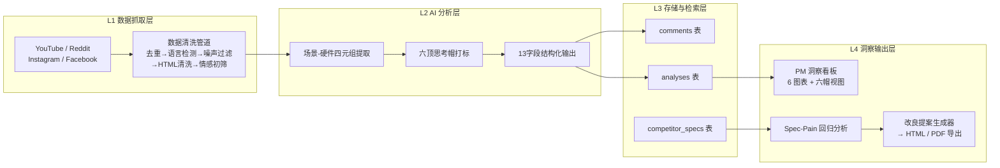
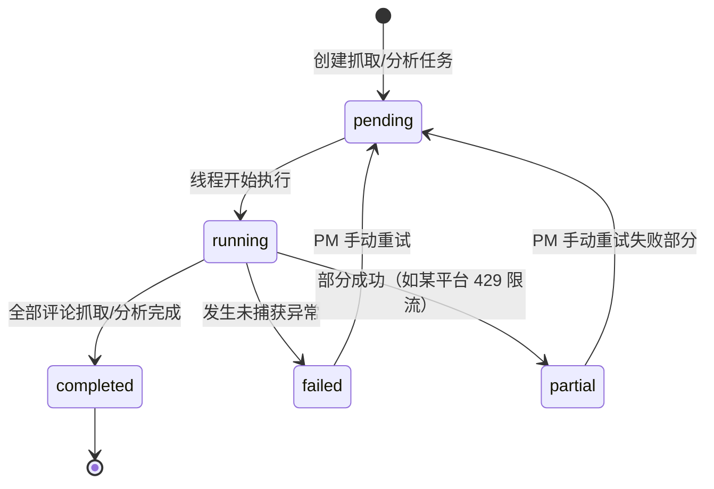
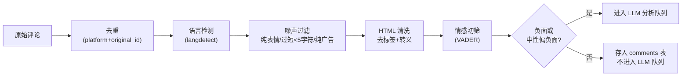
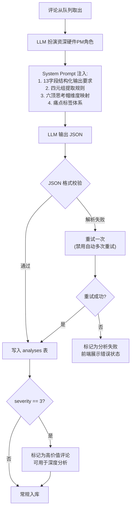
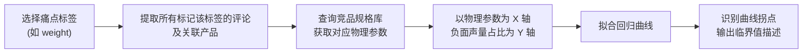
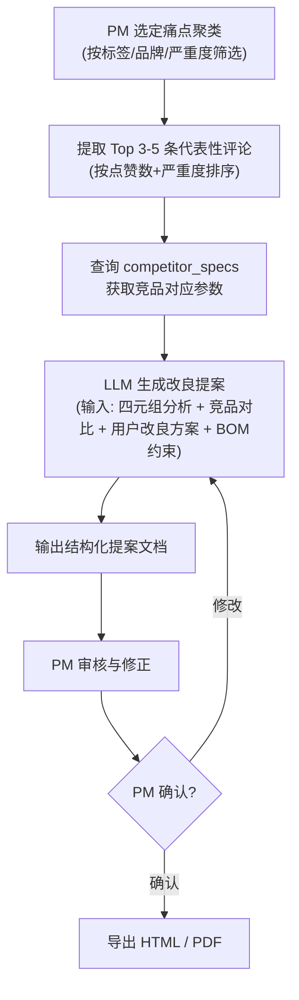
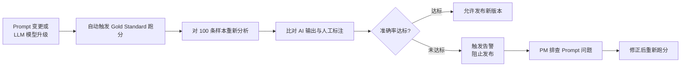

# 一站式 AI 市场与需求看板 PRD（最终版）

## 1. 文档信息与需求分类

| 项目 | 内容 |
|------|------|
| 文档名称 | 一站式 AI 市场与需求看板 PRD（最终版） |
| 产品定位 | 专为硬件/出海产品经理打造的开源一站式 AI 市场与需求看板 |
| 当前版本 | v1.2.2 已交付（v2.0 升级 Phase 1+2：质量过滤 + 痛点聚类；v1.2.2：评论一键 AI 中文翻译），本 PRD 为理论升级后的目标终态 |
| 项目方 | RugOne 团队 |
| 创建日期 | 2026-08-18 |
| 最近更新 | 2026-09-02 |

**需求五维度分类：**

| 维度 | 分类 | 依据 |
|------|------|------|
| 需求类型 | 0-to-1 产品 + AI 产品 + 硬件产品 | 系统从零搭建，核心能力依赖 LLM 分析，输出面向硬件研发 |
| 复杂度 | 重量级（20+ 页） | 多平台采集 + AI 分析 + 竞品回归 + 提案生成，跨四个功能域 |
| 受众 | 工程团队 + 产品管理 | PM 驱动需求，工程师据此开发，管理层据此决策 |
| 行业 | 硬件/IoT | 消费电子产品产品线 |
| 风险等级 | 高 | AI 打标准确率影响产品决策，硬件规格变更成本不可逆 |

**信息完整度评估：**

| 维度 | 状态 | 说明 |
|------|------|------|
| 业务背景 | 充分 | 触发源明确，痛点已量化 |
| 用户定义 | 充分 | 三个角色 persona 含使用频率与决策权 |
| 功能范围 | 部分 → 补全 | 缺 Feature Overview Table，本次补齐 |
| 竞品证据 | 部分 | 竞品类型已列，缺具体产品对标数据 `[To be confirmed]` |
| 约束与规则 | 部分 | LLM 输出字段已定义，部分模块字段校验待补充 |
| 边界与异常 | 部分 | 风险表已覆盖全局，按模块补充边界条件 |
| 数据指标 | 缺失 → 补全 | 本次新增 Metrics & Tracking 模块 |
| 时间线与依赖 | 充分 | 三阶段路线图含里程碑与验证标准 |
| 风险与合规 | 充分 | 风险表含概率、影响、应对策略 |

---

## 2. 产品核心理念与理论模型

硬件产品开发的核心矛盾在于：用户体验声量无法直接转化为工程研发语言。用户说"按键手感差"，工程师需要的是"按键行程从 0.5mm 调整至 1.2mm 并增加触觉反馈凸点"。这中间的翻译鸿沟，是硬件 PM 每天面对的最大痛点。

本系统基于两套理论模型构建分析框架，将非结构化的用户反馈深度还原为物理场景与硬件规格限制，形成从"海量声量采集"到"硬件规格改良提案"的完整交付链。

### 2.1 SECI 默会知识转化模型

用户的真实使用体验是一种默会知识（Tacit Knowledge）——难以用语言精确表达，却深刻影响产品满意度。系统通过 SECI 模型的四个阶段实现默会知识的显性化提炼：

| 阶段 | 转化路径 | 系统对应环节 |
|------|----------|--------------|
| Socialization（社会化） | 隐性 → 隐性 | 多渠道采集用户在社媒/论坛/电商的原始声量，保留用户原话与平台语境 |
| Externalization（外化） | 隐性 → 显性 | LLM 将用户原话提炼为"场景-硬件-行为-根因"四元组结构化数据 |
| Combination（组合化） | 显性 → 显性 | 竞品规格回归分析、六顶思考帽多维交叉、痛点聚类与优先级排序 |
| Internalization（内化） | 显性 → 隐性 | 生成硬件规格改良提案与工程验收用例，PM 基于此做出工程决策 |

系统的核心价值在于 Externalization 阶段：将用户"手套太厚按不准侧键"这类模糊抱怨，转化为"低温 -20℃ 环境下戴滑雪手套盲操侧键，按键行程 0.5mm 不足以提供明确触觉反馈"这样的工程语言。

### 2.2 六顶思考帽分析法

传统情感分析将评论粗暴地分为"正面/负面"，无法支撑硬件产品决策。六顶思考帽为每条评论提供六维度结构化标签，确保 PM 决策时同时覆盖事实、情绪、风险、机会与创新：

| 帽色 | 分析维度 | 在系统中的产出 |
|------|----------|----------------|
| 白帽（事实） | 客观数据与事实陈述 | 评论原文、平台、时间戳、点赞数、产品型号匹配 |
| 红帽（情绪） | 用户情绪强度与类型 | 情感指数 1-5 + 情绪标签（愤怒/失望/满意/惊喜） |
| 黑帽（风险） | 缺陷识别与使用风险 | 严重程度 1-3 + 致命缺陷标记 + 场景风险描述 |
| 黄帽（价值） | 用户认可的功能与价值点 | 正面反馈标签 + 值得保持的设计亮点 |
| 绿帽（创新） | 用户自发的改良方案与跨界灵感 | user_solution 提取 + 微创新机会标记 |
| 蓝帽（管控） | 证据链完整性与分析质量校验 | Gold Standard 跑分 + 人工修正反馈闭环 |

六顶思考帽不是独立的分析模块，而是嵌入 LLM 结构化输出的强制维度。每条评论经过分析后都带有六维标签，PM 可在看板上按帽色切换视角审视同一批数据。

---

## 3. 需求背景与目标

### 3.1 背景

RugOne 团队专注消费电子产品产品线。目标用户高度聚集在 YouTube、Reddit 等海外社媒平台，评论中蕴含大量关于电池续航、屏幕表现、按键手感、系统体验等维度的真实使用反馈。

当前痛点 `[PM judgment]`：

- 声量分散：用户反馈散布在 YouTube 评论、Reddit 帖子、Instagram 帖子中，PM 需手工逐平台浏览，效率极低。
- 归因模糊：用户抱怨"手感差""不好按""太重"，但无法定位到具体硬件规格（按键行程、机身重量、重心分布），工程团队无法直接行动。
- 缺乏竞品对标：各竞品的硬件规格参数没有统一数据库，无法回答"对手 380g 不被骂笨重，我们 360g 却被吐槽，差异到底在哪"。
- 交付断裂：现有分析停留在"看板展示"层面，PM 需手动将分析结果整理成需求文档，再转译为工程语言，链条断裂。

### 3.2 目标

| 目标 | 衡量标准 |
|------|----------|
| 多平台声量自动采集 | 支持 YouTube（P0）、Reddit、Instagram、TikTok 四平台评论级抓取 |
| 默会知识显性化 | 每条负面评论输出"场景-硬件-行为-根因"四元组，归因到具体硬件规格 |
| 六维结构化分析 | 每条评论输出六顶思考帽六维标签 + 13 个结构化字段 |
| 竞品规格对标 | 建立竞品物理参数库，自动拟合体验临界值 |
| 闭环交付 | 基于痛点聚类一键导出《硬件规格改良提案》，含工程验收用例 |
| 打标准确率 | Gold Standard 100 条样本，准确率 > 70%（Phase 1），人工修正后 > 90%（Phase 3） |

---

## 4. 市场与竞品分析

### 4.1 目标市场

消费电子产品市场体量庞大、迭代迅速 `[To be confirmed — 需补充权威市场报告引用]`。核心用户群体为对硬件参数敏感度高的消费者与专业用户。这类用户在社媒平台上有较强的表达意愿，评论数据蕴含丰富的真实使用反馈，数据质量远高于传统问卷渠道。

### 4.2 竞品分析

当前市场缺乏专门面向硬件产品 PM 的 AI 痛点分析工具。现有方案的局限：

| 竞品类型 | 代表产品 | 局限 |
|----------|----------|------|
| 通用舆情监控 | Brandwatch, Talkwalker | 面向品牌营销，不分析硬件规格，无法归因到工程参数 |
| 用户反馈管理 | Productboard, UserVoice | 面向 SaaS 产品，依赖用户主动提交反馈，不做社媒爬取 |
| 社媒数据 API | Apify, Bright Data | 只提供数据管道，无 AI 分析、无痛点归因、无改良提案 |
| 通用 AI 分析 | ChatGPT, Claude 通用对话 | 无领域知识、无批量处理、无结构化输出、无可追溯性 |

差异化定位：唯一将"社媒声量采集 → 默会知识显性化 → 竞品规格回归 → 硬件改良提案生成"打通为完整链条的工具，且专为硬件产品经理设计。

---

## 5. 用户角色与使用场景

### 5.1 目标用户

| 角色 | 使用频率 | 技术熟练度 | 决策权 | 核心诉求 |
|------|----------|-----------|--------|----------|
| 硬件产品经理（主用户） | 每日/每周 | 中高 | 需求优先级、规格定义 | 从用户声量中提取可落地的硬件改良需求 |
| 研发工程师 | 按需 | 高 | 技术方案选择 | 获取改良提案中的建议规格与验收用例 |
| 市场分析师 | 每周 | 中 | 市场策略建议 | 追踪竞品用户口碑变化与市场趋势 |

### 5.2 核心使用场景

**场景一：改良需求挖掘（PM 日常）**
PM 打开看板，选择某竞品品牌 + "button"痛点标签，查看按键相关负面评论聚类。系统展示四元组分析结果，PM 发现多条评论提到"戴手套按不准侧键"。点击展开原声追溯链接，确认评论真实性。系统已将该聚类与竞品规格库对比，提示"竞品 A 侧键行程 1.2mm，本品牌 0.5mm"。PM 一键导出改良提案，提交研发。

**场景二：竞品对标分析（PM/市场）**
PM 选择三个竞品品牌，在 Spec-Pain Matrix 中查看重量维度的回归曲线。系统显示"机身重量超过 380g 后，'手感笨重'负面声量呈指数级上升"，而竞品 A 当前主力机型 420g，正好落在临界点之上。PM 据此向研发提出减重至 380g 以内的改良目标。

**场景三：改良提案交付（PM → 研发）**
PM 选定"低温环境按键盲操"痛点聚类，点击"生成改良提案"。系统输出：3 条代表性用户原声及来源链接 + 建议规格（按键行程 0.5mm → 1.2mm，增加触觉反馈凸点）+ 工程验收用例（模拟 -20℃ 戴滑雪手套连续按压 100 次，成功率 > 95%）。PM 审核后直接转发研发。

---

## 6. 系统整体架构

系统采用四层架构，数据从左向右单向流动，每层输入为上一层的输出：



| 层级 | 职责 | 设计原则 |
|------|------|----------|
| L1 数据抓取层 | 多平台评论采集、数据清洗、情感初筛 | 原声可追溯：所有采集的评论保留平台原始 ID 与跳转链接 |
| L2 AI 分析层 | 场景-硬件四元组提取、六顶思考帽打标、痛点归因 | 默会知识显性化：LLM 输出强制四元组结构 |
| L3 存储与检索层 | 结构化存储、原声追溯、竞品规格库 | 分层解耦：任一层可独立升级 |
| L4 洞察输出层 | 看板可视化、Spec-Pain 回归、改良提案生成 | 闭环交付：从分析结果到工程提案一键导出 |

离线可用：单机 exe 打包，无需联网部署服务器，所有 LLM 调用通过用户自配 API Key 完成。

---

## 7. 功能模块详细需求

### 7.0 功能全量索引表

| # | 模块 | 功能描述 |
|---|------|----------|
| F1 | 数据采集 — 平台选择 | 用户选择目标平台（YouTube/Reddit/Instagram/Facebook），平台列表从后端动态获取，展示引擎名称与技术描述。支持多选。选择后联动品牌选择区。 |
| F2 | 数据采集 — 品牌与关键词 | 用户选择品牌（下拉菜单，与设置页同步），输入搜索关键词（逗号分隔，每段独立搜索）。关键词缺省时使用品牌默认关键词。"全部品牌"使用 OR 查询减少请求次数。 |
| F3 | 数据采集 — 抓取执行 | 点击抓取后后端异步执行，前端轮询进度。抓取结果写入 comments 表，任务状态写入 jobs 表。进度条实时展示已抓取评论数。 |
| F4 | 数据采集 — 数据清洗 | 评论依次经过去重（platform+original_id 唯一约束）、语言检测（langdetect）、噪声过滤（纯表情/过短/纯广告）、HTML 清洗、情感初筛（VADER，仅负面+中性偏负面进入 LLM 队列）。 |
| F5 | 数据采集 — 历史记录 | 按批次展示历史抓取任务及状态，支持查看任务详情和重新触发分析。 |
| F6 | AI 分析 — 四元组提取 | LLM 扮演"资深硬件产品经理"角色，对每条评论输出"场景-硬件-行为-根因"四元组，将模糊抱怨还原为物理场景与工程根因。 |
| F7 | AI 分析 — 13 字段结构化输出 | 每条评论输出 13 个结构化字段（情感指数/痛点归因/痛点标签/严重度/用户改良方案/产品匹配/中文摘要/四元组4字段/正面标签/情绪类型），映射六顶思考帽六维。 |
| F8 | AI 分析 — LLM 路由 | 支持 5 家 LLM 提供商切换（Gemini/DeepSeek/GLM/Kimi/通义千问），用户在设置页配置 API Key。401 提示更新 Key，429 提示限流，超时提示检查网络。 |
| F9 | AI 分析 — 批量分析 | 选择批次大小后一键启动批量分析，后端异步执行，前端轮询进度。分析结果写入 analyses 表。 |
| F10 | AI 分析 — 人工修正 | PM 可纠正错误的 pain_tags 或 severity，修正记录写入 analyses 表并进入训练数据集。 |
| F11 | 洞察看板 — 六帽视图 | PM 点击帽色切换数据切片维度，下方痛点列表/图表/评论浏览器同步刷新为对应维度数据。六种视角：事实/情绪/风险/价值/创新/管控。 |
| F12 | 洞察看板 — 痛点分布图 | 横向条形图展示痛点标签分布 Top 15，按严重度颜色分层。支持按品牌/平台/时间筛选。 |
| F13 | 洞察看板 — 严重度分布 | 饼图展示三档严重度分布（轻微吐槽/影响体验/致命缺陷）。 |
| F14 | 洞察看板 — 优先级矩阵 | 散点图，横轴频次、纵轴平均严重度、气泡大小=综合得分。右上象限=最高优先级改良机会。 |
| F15 | 洞察看板 — 品牌×痛点热力图 | 二维矩阵，颜色深浅=某品牌在某痛点上的提及次数。点击格子展开 Top 20 评论。 |
| F16 | 洞察看板 — 型号痛点排名 | 条形图，按高严重度痛点数排序 Top 20 产品型号。 |
| F17 | 洞察看板 — 竞品规格回归 | 散点+回归线图，物理参数为 X 轴、负面声量占比为 Y 轴，标注临界值与竞品对比。参数和痛点标签可联动选择。 |
| F18 | 洞察看板 — 原声追溯 | 点击任意痛点展开查看评论原文、来源平台与时间戳、视频/帖子标题与跳转链接、评论作者与头像。 |
| F19 | 竞品规格库 — 参数录入 | PM 手动录入或 CSV 批量导入竞品硬件规格（机身重量/电池容量/防护等级/屏幕亮度/按键行程等），标注数据来源 URL。 |
| F20 | 竞品规格库 — 临界点拟合 | 系统自动将用户负面声量与竞品物理规格回归拟合，识别体验临界值（如"机身重量超过 380g 后负面声量指数级上升"）。 |
| F21 | 改良提案 — 生成 | PM 选定痛点聚类（按标签/品牌/严重度筛选），系统提取 Top 3-5 代表性评论 + 查询竞品规格 + LLM 生成改良提案。 |
| F22 | 改良提案 — 痛点证据链 | 自动附带 3-5 条代表性用户反馈原文及来源链接，每条附带四元组分析结果。 |
| F23 | 改良提案 — 建议规格 | 基于竞品规格库与回归分析，给出具体参数建议（如"按键行程 0.5mm → 1.2mm，对标竞品旗舰机型"）。 |
| F24 | 改良提案 — 工程验收用例 | 基于场景四元组自动生成测试标准（如"模拟 -20℃ 戴滑雪手套连续按压侧键 100 次，成功率 > 95%"）。 |
| F25 | 改良提案 — 报告导出 | 支持 HTML（后端写入配置目录，内联 ECharts）和 PDF（隐藏 iframe 调用浏览器打印）两种格式。导出目录可在设置页配置，默认桌面。 |
| F26 | 仪表盘 — 统计卡片 | 总评论数、已分析数、品牌数、视频数、高严重度痛点数，点击可下钻至详情。 |
| F27 | 仪表盘 — 痛点列表 | 支持按型号/严重度/情感/痛点标签筛选，按严重度/情感/点赞数排序的表格。 |
| F28 | 配置管理 — LLM 设置 | API Key、模型选择、当前激活提供商配置，API Key 脱敏展示。 |
| F29 | 配置管理 — 平台凭据 | Reddit OAuth、Instagram 账号密码、Facebook cookies 配置，敏感凭据 DPAPI 加密存储。 |
| F30 | 配置管理 — 品牌管理 | 品牌名称、搜索关键词、关联产品管理，与数据采集页自动同步。 |
| F31 | 配置管理 — 导出配置 | 导出目录路径配置，提供"浏览"按钮选择文件夹。 |
| F32 | 质量控制 — Gold Standard | 100 条人工标注样本，Prompt/模型变更时自动跑分比对，输出准确率/标签偏差/严重度漂移指标，低于阈值触发告警。 |
| F33 | 质量控制 — PM 决策干预 | 支持优先级调整（P0/P1/P2）、BOM 成本与模具约束输入（LLM 遵守约束生成提案）、标签修正。 |

---

### 7.1 多渠道声量采集与原声追溯

#### 页面布局

数据采集页面（导航栏"数据采集"标签）包含以下区域：

- 平台选择区：复选框列表，动态从后端获取，展示引擎名称与技术描述
- 品牌选择区：下拉菜单，品牌列表与设置页自动同步
- 搜索配置区：关键词输入框（逗号分隔）、最大抓取数量输入框
- 操作区：抓取按钮（触发后变为进度条）、批量分析按钮
- 结果展示区：实时抓取进度 + 评论数统计
- 历史记录区：按批次展示历史抓取任务及状态

#### 业务逻辑（F1-F3）

用户选择目标平台和品牌，输入搜索关键词（可选，缺省使用品牌默认关键词）。关键词以逗号分隔，每段独立搜索。选择"全部品牌"时使用 OR 查询（如 `BrandA OR BrandB`）以减少请求次数。

点击抓取后，后端异步执行，前端轮询进度。抓取结果写入 comments 表，同时写入 jobs 表记录任务状态。

后台任务状态流转：



#### 各平台抓取策略（F1 细则）

| 平台 | 评论级支持 | 策略与约束 |
|------|-----------|------------|
| YouTube（P0） | 完整支持 | yt-dlp `--write-comments`，每日全量 + 新视频增量，免费 |
| Reddit | 完整支持 | Reddit API (PRAW) + JSON/RSS fallback；指数退避重试（10s→30s→60s，最多 4 次），尊重 Retry-After 头；搜索与评论间隔 5s；帖子间隔 3s 防止 429 |
| Instagram | 完整支持 | Instaloader；需用户配置账号密码（设置页输入，DPAPI 加密存储） |
| TikTok | 仅元数据 | 评论级抓取暂不支持（需 Playwright 浏览器自动化，增加 ~200MB 体积，不适合单机打包） |
| Facebook | 完整支持 | facebook-scraper；需用户配置 cookies（JSON 数组或分号分隔，设置页输入，DPAPI 加密存储） |

Reddit 的 .json 和 RSS 端点会封锁无认证访问，必须使用 session cookies，通过 PRAW OAuth 认证解决。

边界条件：
- 平台 API 返回 401（凭据过期）→ 标记任务为 partial，前端提示"请到设置页更新 [平台] 凭据"
- 平台 API 返回 429（限流）→ 触发指数退避重试，超过 4 次后标记 partial
- 评论数为 0 → 前端展示空状态"未找到匹配评论，请尝试调整关键词"
- 网络超时（60s）→ 标记 failed，前端提示"网络超时，请检查连接后重试"

#### 数据清洗管道（F4）



情感初筛仅将负面 + 中性偏负面评论送入 LLM 分析队列，减少 40-60% 的 LLM 调用成本。

#### 原声追溯机制（F18）

每条 AI 分析结果通过 comment_id 外键关联到原始评论。前端在看板中点击任意痛点，可展开查看：评论原文、来源平台与时间戳、视频/帖子标题与跳转链接、评论作者与头像。这确保了 SECI 模型中 Socialization 阶段采集的隐性知识始终可追溯。

---

### 7.2 场景-硬件双轴打标引擎

这是本系统区别于通用舆情工具的核心模块。针对默会知识的显性化提炼，LLM 分析层强制采用"场景-硬件-行为-根因"四元组结构化提取。

#### 四元组结构化字段

| 结构化字段 | 字段说明 | 示例 |
|-----------|----------|------|
| Context Environment | 使用时的物理环境、气候或佩戴护具状况 | 降雨 / 低温 / -20℃ / 戴厚重雪地手套 |
| Hardware Component | 涉及的具体硬件元器件或结构设计 | 自定义侧键 / 盲操凸起 / 电池防寒层 |
| User Action | 用户当时的实际操作与交互行为 | 户外徒步中戴手套盲按侧键 |
| Pain Root Cause | 物理/工程层面的根本原因分析 | 按键行程太短（0.5mm）且缺乏明确触觉反馈 |

#### 完整 LLM 结构化输出字段（F7）

四元组嵌入在完整的 LLM 分析输出中。每条评论经 LLM 分析后输出 13 个结构化字段：

| # | 字段名 | 类型 | 说明 | 六帽映射 |
|---|--------|------|------|----------|
| 1 | sentiment_score | int 1-5 | 情感指数（1=极度负面，3=中性，5=极度正面） | 红帽 |
| 2 | pain_categories | array | 痛点归因：hardware / software / scenario / ecosystem（可多选） | 黑帽 |
| 3 | pain_tags | array | 具体痛点标签（见下方标签表） | 黑帽 |
| 4 | severity | int 1-3 | 严重程度（1=轻微吐槽，2=影响体验，3=致命缺陷） | 黑帽 |
| 5 | user_solution | text/null | 用户改良方案原文（没有则 null） | 绿帽 |
| 6 | product_match | string | AI 识别的具体产品型号 | 白帽 |
| 7 | summary_zh | text | 50 字以内中文摘要 | 白帽 |
| 8 | context_environment | text | 使用场景环境描述（四元组字段 1） | 白帽 |
| 9 | hardware_component | text | 涉及硬件元器件（四元组字段 2） | 黑帽 |
| 10 | user_action | text | 用户操作行为（四元组字段 3） | 白帽 |
| 11 | pain_root_cause | text | 物理/工程根因（四元组字段 4） | 黑帽 |
| 12 | positive_tags | array | 用户认可的功能与价值点 | 黄帽 |
| 13 | emotion_type | string | 情绪类型标签：anger/disappointment/satisfaction/surprise/neutral | 红帽 |

#### 痛点标签体系

预设 13 个痛点标签，覆盖电子产品核心硬件维度：

| 标签 | 中文 | 说明 |
|------|------|------|
| battery | 电池 | 续航、充电速度、电池衰减 |
| screen | 屏幕 | 亮度、触控灵敏度、碎屏 |
| waterproof | 防水 | IP 等级失效、进水 |
| system | 系统 | 卡顿、崩溃、兼容性 |
| weight | 重量 | 手感笨重、便携性 |
| signal | 信号 | 通话质量、网络连接 |
| camera | 摄像头 | 拍照质量、对焦 |
| button | 按键 | 手感、盲操、误触 |
| charging | 充电 | 接口、无线充 |
| durability | 耐用性 | 掉漆、结构松动 |
| app_pairing | App 配对 | 蓝牙、配套 App |
| ota | OTA 更新 | 系统更新、固件 |
| ui | 用户界面 | 交互逻辑、易用性 |

#### LLM 分析流程（F6-F9）



#### LLM 路由与错误处理（F8）

| 模型 | 角色 | 适用场景 | 成本 |
|------|------|----------|------|
| Gemini 2.5 Pro | 主力 | 批量情感分类、初步标签化 | 最低 |
| DeepSeek / GLM / Kimi / 通义千问 | 国内替代 | 用户自选，OpenAI 兼容接口接入 | 按各家定价 |
| Claude 4 | 深度分析 | 高价值负面评论（severity=3）的深层根因分析 | 较高 |
| GPT-4o | 兜底校验 | 对存疑结果做二次校验 | 中等 |

5 家 LLM 提供商通过 OpenAI 兼容接口统一接入，用户在设置页配置 API Key 和模型选择。错误提示规范：
- 401 → "LLM API Key 已过期或无效，请到设置页面更新 [提供商] 的 API Key"
- 429 → "LLM 请求被限流，请稍后重试"
- 超时（60s）→ "LLM 请求超时，请检查网络后重试"

---

### 7.3 六顶思考帽多维分析视图（F11）

在 PM 洞察看板中新增六帽视角切换功能。PM 点击对应帽色，看板数据按该维度重新组织展示：

| 帽色视角 | 看板展示内容 | 典型用途 |
|----------|-------------|----------|
| 白帽（事实） | 按平台/时间/产品维度统计评论分布，展示原始数据概览 | 了解声量全貌与数据质量 |
| 红帽（情绪） | 情感分布饼图 + 情绪类型分布 + 情绪强度趋势曲线 | 识别用户情绪变化趋势 |
| 黑帽（风险） | severity=3 致命缺陷列表 + 场景风险热力图 | 优先处理致命缺陷 |
| 黄帽（价值） | positive_tags 正面反馈排行 + 用户认可的设计亮点 | 保持并发扬优势设计 |
| 绿帽（创新） | user_solution 用户改良方案汇总 + 微创新机会清单 | 从用户原话中提取创新灵感 |
| 蓝帽（管控） | Gold Standard 跑分结果 + 人工修正率统计 + 标签分布异常告警 | 监控分析质量与模型漂移 |

六帽视图不是六个独立页面，而是同一数据集的六种切片方式。切换帽色时，下方痛点列表、图表、评论浏览器同步刷新为对应维度的数据。

---

### 7.4 竞品硬件规格与痛点回归分析（F19-F20）

#### 竞品参数常量库（F19）

建立竞品硬件规格数据库，PM 可手动录入或通过 CSV 批量导入以下物理参数：

| 参数类别 | 具体字段 | 单位 | 示例 |
|----------|----------|------|------|
| 机身 | 重量 | g | 420 |
| 机身 | 三围 | mm | 173×82×13 |
| 电池 | 容量 | mAh | 22000 |
| 电池 | 快充功率 | W | 33 |
| 防护 | 防护等级 | - | IP68/IP69K |
| 防护 | 跌落标准 | m | 1.5 |
| 屏幕 | 尺寸 | inch | 6.7 |
| 屏幕 | 亮度 | nits | 1300 |
| 按键 | 侧键行程 | mm | 0.5 |
| 按键 | 触觉反馈 | 有/无 | 无 |
| 处理器 | 型号 | - | Helio G99 |
| 内存/存储 | RAM/ROM | GB | 8/256 |

每条规格记录标注数据来源 URL，缺失参数标记为"待补充"。

#### 临界点拟合分析（F20）

系统自动将用户负面声量与竞品物理规格回归拟合，识别体验临界值：



典型输出示例：

> 机身重量 x "手感笨重" 回归分析
> 临界值：380g。超过 380g 后，"手感笨重"负面声量从 12% 跃升至 45%，呈指数级上升。
> 当前本品牌主力机型：420g（超出临界值 40g）。
> 竞品机型 A：360g（低于临界值，负面声量 8%）。
> 建议：将下一代产品重量控制在 380g 以内。

边界条件：
- 竞品规格数据不足 3 个产品 → 提示"数据量不足以拟合回归曲线，请补充至少 3 个竞品规格"
- 痛点标签评论数不足 10 条 → 提示"样本量不足，回归结果仅供参考"
- 物理参数为非数值类型（如"有/无"触觉反馈）→ 改为分组对比而非回归拟合

---

### 7.5 PM 洞察看板（F12-F18）

#### 导航结构

应用包含五个导航标签页：仪表盘 | 数据采集 | 洞察看板 | 改良建议 | 设置（齿轮图标）

#### 仪表盘页面（F26-F27）

- 统计卡片：总评论数、已分析数、品牌数、视频数、高严重度痛点数（点击可下钻）
- 痛点标签云：Top 10 高频痛点标签，按严重度颜色分层
- 痛点列表表格：支持按型号/严重度/情感/痛点标签筛选，按严重度/情感/点赞数排序
- 评论浏览器：按品牌分组的评论列表 + 每组 Top 5
- 分析详情弹窗：按品牌和严重度筛选，展示四元组分析详情
- AI 分析按钮：选择批次大小后一键启动批量分析

#### 洞察看板页面（F12-F17）

核心可视化组件：

| 组件 | 图表类型 | 对应功能 | 说明 |
|------|----------|----------|------|
| 痛点标签分布 Top 15 | 横向条形图 | F12 | 按严重度颜色分层 |
| 严重度分布 | 饼图 | F13 | 轻微吐槽/影响体验/致命缺陷三档 |
| 情感分布 | 饼图 | F12 | 极度负面/负面/中性/正面/极度正面五档 |
| 优先级矩阵 | 散点图 | F14 | 横轴频次、纵轴平均严重度、气泡大小=综合得分 |
| 品牌×痛点热力图 | 二维矩阵 | F15 | 颜色深浅=某品牌在某痛点上的提及次数 |
| 型号痛点排名 | 条形图 | F16 | 按高严重度痛点数排序 Top 20 |
| 竞品规格回归图 | 散点+回归线 | F17 | 物理参数 × 负面声量占比，标注临界值 |
| 六帽视角切换器 | 标签页切换 | F11 | 点击帽色切换数据切片维度 |

#### 交互逻辑

筛选（品牌/平台/时间/痛点标签/严重度）→ 图表联动更新 → 点击气泡/热力格子展开 Top 20 负面评论 → 标记"高价值" → 导出报告。每条展开的评论均可点击跳转至原始来源平台（F18）。

---

### 7.6 硬件规格改良提案生成器（F21-F25）

系统不局限于查看分析看板，可基于选定的痛点聚类一键导出工程级《硬件规格改良提案》。

#### 生成流程（F21）



#### 改良提案结构（F22-F24）

1. 痛点证据链（F22）：自动附带 3-5 条代表性用户反馈原文及来源链接。每条附带四元组分析结果（场景-硬件-行为-根因），确保工程师理解问题的物理本质。

2. 建议规格（F23）：基于竞品规格库与回归分析，给出具体参数建议。如"将按键行程从 0.5mm 调整至 1.2mm（对标竞品旗舰机型），增加硬件级防误触按键锁"。

3. 工程验收用例（F24）：自动基于场景四元组生成测试标准。如"模拟 -20℃ 环境下戴滑雪手套连续按压侧键 100 次，成功率 > 95%；按键行程实测值 ≥ 1.2mm；触觉反馈力 ≥ 2N"。

#### 报告导出（F25）

| 格式 | 实现方式 | 特性 |
|------|----------|------|
| HTML | 后端写入配置目录，返回完整路径 | 独立文件，文件名含日期，内联 ECharts 库与图表数据，支持离线交互查看 |
| PDF | 隐藏 iframe 调用浏览器打印对话框（避免 pywebview 弹窗限制） | 自动切换至亮色主题打印，导出后恢复原主题 |

导出目录可在设置页配置，提供"浏览"按钮选择文件夹，默认用户桌面。报告生成与导出解耦：generateReport() 更新 lastReportHtml / lastReportCharts / lastReportTime，导出按钮使用这些变量的当前值。

报告内容结构：

```
报告标题 + 生成时间 + 导出按钮
    |
    +-- 数据概览卡片（总评论/已分析/高严重度/品牌数）
    |
    +-- 4 张图表
    |   +-- 痛点标签分布 Top 10（柱状图）
    |   +-- 严重度分布（饼图）
    |   +-- 品牌×痛点热力图
    |   +-- 优先级矩阵（散点图）
    |
    +-- LLM 文字分析
        +-- 高频痛点改良建议（Top 5，含痛点描述/影响范围/技术方向/优先级）
        +-- 竞品差距分析（基于 Spec-Pain Matrix）
        +-- 微创新机会清单（含用户原话依据）
        +-- 改良优先级清单（Top 10）
```

---

### 7.7 配置管理（F28-F31）

设置页面加载所有配置（LLM + Reddit + Instagram + Facebook + 品牌列表 + 导出设置）并行获取。

| 配置类别 | 配置项 | 存储方式 |
|----------|--------|----------|
| LLM 提供商 | API Key、模型选择、当前激活提供商 | settings 表，API Key 脱敏展示 |
| Reddit | OAuth credentials | settings 表 |
| Instagram | 用户名 + 密码 | settings 表，DPAPI 加密 |
| Facebook | cookies（JSON 数组或分号分隔） | settings 表，DPAPI 加密 |
| 品牌管理 | 品牌名称、搜索关键词、关联产品 | brands + products 表，与数据采集页自动同步 |
| 导出配置 | 导出目录路径 | settings 表 |

品牌列表与数据采集配置页自动同步：在设置页新增品牌后，数据采集页的品牌下拉框立即可选。

---

### 7.8 硬件产品规格约束

本系统的输出面向硬件研发，需考虑硬件产品的特殊性：

| 约束维度 | 说明 | 系统应对 |
|----------|------|----------|
| BOM 成本 | 每项硬件改良有物料成本上限，超出需重新评估 ROI | PM 在改良提案生成前输入 BOM 成本上限，LLM 遵守约束生成建议 |
| 模具约束 | 本代模具通常不修改，仅允许芯片级/固件级调整 | PM 输入模具约束（如"本代模具冻结"），LLM 仅生成不涉及模具变更的方案 |
| 规格冻结周期 | 硬件规格在量产前 6 个月冻结，冻结后仅接受缺陷修复 | 改良提案标注"适用于下一代产品"或"适用于当前产品 OTA 修复" |
| 生产测试 | 每项规格变更需对应生产测试标准 | 工程验收用例自动生成，含环境模拟参数与合格阈值 |
| 售后反馈 | 量产后的售后退货数据应回流到系统 | `[规划 — Phase 3]` 支持售后 CSV 导入，形成"量产→售后→改良"循环 |

---

## 8. AI 准确率与评估体系

### 8.1 准确率定义

AI 分析的质量直接影响 PM 的产品决策，需从多个维度定义和衡量准确率：

| 质量维度 | 定义 | 阈值（Phase 1 / Phase 3） |
|----------|------|--------------------------|
| 标签准确率 | pain_tags 与人工标注的命中率 | > 70% / > 90% |
| 严重度偏差率 | severity 分级与人工标注一致的比例 | < 15% / < 8% |
| 情感方向一致率 | sentiment_score 正负方向与人工一致 | > 85% / > 95% |
| 四元组完整率 | 非空字段占四元组总字段的比例 | > 80% / > 95% |
| 根因合理性 | pain_root_cause 在工程层面可解释且可行动 | 人工抽检通过率 > 75% |

### 8.2 离线评估体系

**Gold Standard 基准集（F32）**：预置 100 条人工标准打标样本，覆盖各痛点标签、严重度等级和典型场景。每次 Prompt 变更或 LLM 模型升级时，自动对 100 条样本重新跑分比对，输出准确率、标签分布偏差、严重度漂移指标。跑分结果低于阈值时触发告警，防止模型漂移导致分类失真与痛点优先级错乱。

样本构成要求：
- 覆盖全部 13 个痛点标签，每个标签至少 5 条样本
- 覆盖三档严重度（1/2/3），比例约 3:5:2
- 覆盖五大平台（YouTube/Reddit/Instagram/Facebook/TikTok）
- 包含边界样本（如一条评论同时提到多个痛点）和负样本（如一条中性评论被误判为负面）
- 包含回归样本（历史版本中曾分析错误的评论，防止同类错误复发）

### 8.3 人工审查机制

- PM 可纠正错误的 pain_tags 或 severity，修正记录写入 analyses 表的 human_corrected / corrected_by / corrected_at 字段
- 修正记录进入训练数据集，用于后续 Prompt 优化
- 系统统计人工修正率（已修正评论数 / 已分析评论数），修正率超过 20% 时触发蓝帽告警

### 8.4 在线反馈指标

| 行为指标 | 定义 | 决策用途 |
|----------|------|----------|
| 标记高价值率 | PM 标记"高价值"的评论数 / 总分析评论数 | 衡量分析结果对 PM 的有用程度 |
| 改良提案采纳率 | 被 PM 确认导出的提案数 / 生成的提案总数 | 衡量提案生成器的输出质量 |
| 研发采纳率 | 被研发团队接受的提案数 / PM 提交的提案总数 | 衡量提案的工程可执行性 |
| 标签修正率 | 人工修正评论数 / 已分析评论数 | 衡量 AI 分析准确率，>20% 触发告警 |

### 8.5 Go/No-Go 标准

| 门槛 | 标准 | 不通过时的行动 |
|------|------|---------------|
| 准确率门槛 | Gold Standard 跑分标签准确率 > 70%（Phase 1） | 不发布该版本，回滚到上一稳定 Prompt |
| 体验门槛 | 人工修正率 < 20% | 暂停批量分析，排查高修正率模块 |
| 成本门槛 | 单条评论分析成本 < 0.01 美元 | 优化情感初筛策略，减少 LLM 调用量 |
| 安全门槛 | 四元组无幻觉根因（人工抽检通过率 > 75%） | 加强 Prompt 约束，增加 few-shot 示例 |

### 8.6 降级机制

- LLM 返回结果 JSON 解析失败 → 重试一次，仍失败则标记为分析失败，不写入 analyses 表
- LLM API 不可用 → 暂停批量分析队列，前端提示"LLM 服务暂不可用，请稍后重试"
- 四元组提取为空 → 保留传统 7 字段分析结果，四元组字段标记为 null，不阻断流程
- 竞品规格数据不足 → 回归分析降级为分组对比（有/无该规格的两类产品负面声量对比）

---

## 9. 质量控制与 PM 决策干预（F32-F33）

### 9.1 打标基准集运行机制



### 9.2 PM 决策干预（F33）

在"痛点转化为需求"阶段（改良提案生成前），支持 PM 手动干预：

- 优先级调整：PM 可手动将 AI 标记的 P0/P1/P2 优先级上调或下调
- 成本约束输入：PM 输入 BOM 成本上限与模具约束（如"本代模具不修改，仅允许芯片级调整"），LLM 生成改良提案时遵守此约束
- 标签修正：PM 可纠正错误的 pain_tags 或 severity，修正记录写入数据库并进入训练数据集

这确保 AI 输出的建议符合现实工程与供应链成本限制，而非脱离实际的理想化方案。

---

## 10. 数据指标与追踪

### 10.1 核心指标

| 指标类型 | 指标名称 | 定义 | 目标值 |
|----------|----------|------|--------|
| 北星指标 | 改良提案研发采纳率 | 被研发团队接受的提案数 / PM 提交的提案总数 | > 60%（Phase 3） |
| 过程指标 | 评论采集覆盖率 | 已采集评论数 / 目标平台可获取评论总量 | > 80% |
| 过程指标 | LLM 分析覆盖率 | 已分析评论数 / 已采集评论数 | > 90% |
| 过程指标 | 四元组提取率 | 四元组非空评论数 / 已分析评论数 | > 80% |
| 质量指标 | 标签准确率 | Gold Standard 跑分命中率 | > 70% → > 90% |
| 质量指标 | 人工修正率 | 人工修正评论数 / 已分析评论数 | < 20% |
| 质量指标 | LLM 分析成功率 | 成功分析评论数 / 进入队列评论数 | > 95% |
| 成本指标 | 单条分析成本 | LLM API 总费用 / 已分析评论数 | < $0.01 |

### 10.2 追踪事件

| 事件名称 | 触发时机 | 关键属性 | 决策用途 |
|----------|----------|----------|----------|
| crawl_started | 用户点击抓取按钮 | platform, brand, keyword, max_count | 监控采集活跃度 |
| crawl_completed | 抓取任务完成 | platform, comment_count, duration | 评估采集效率 |
| analyze_started | 用户点击批量分析 | batch_size, brand | 监控分析活跃度 |
| analyze_completed | 分析任务完成 | analyzed_count, success_count, fail_count | 评估分析质量 |
| pain_point_viewed | PM 点击痛点展开详情 | pain_tag, brand, severity | 追踪 PM 关注热点 |
| proposal_generated | 改良提案生成 | pain_tag, has_test_cases, competitor_count | 评估提案生成器使用率 |
| proposal_exported | 提案导出为 HTML/PDF | format, pain_tag | 追踪交付格式偏好 |
| tag_corrected | PM 修正标签 | original_tag, corrected_tag, severity | 追踪常见误标模式 |
| gold_standard_run | Gold Standard 跑分执行 | accuracy, severity_drift, tag_distribution | 监控模型漂移 |

---

## 11. 实施路线图与依赖

### 11.1 三阶段路线图

| 阶段 | 时间 | 交付物 | 验证标准 |
|------|------|--------|----------|
| Phase 1 MVP 验证 | 4-6 周 | YouTube 评论抓取 + Gemini 分析 + 简易看板 + 四元组提取 | 标签准确率 > 70%，100 条 Gold Standard 跑分通过 |
| Phase 2 平台扩展 | 6-8 周 | Reddit/Instagram/Facebook 抓取 + Qdrant 语义搜索 + Spec-Pain Matrix + 竞品规格库 | 覆盖 4 平台 + 5 竞品，语义搜索召回率 > 90% |
| Phase 3 闭环完善 | 6-8 周 | 六顶思考帽多维视图 + 改良提案生成器 + PM 决策干预 + 趋势分析 + 售后数据回流 | 人工修正后标签准确率 > 90%，改良提案研发采纳率 > 60% |

### 11.2 当前实现状态（v0.8）

已实现：多平台评论抓取（YouTube/Reddit/Instagram/Facebook）、AI 结构化痛点分析（7 字段）、5 家 LLM 提供商切换、洞察看板（6 图表）、AI 改良建议报告、桌面应用打包（VoC-Platform.exe）、批量分析、人工修正、报告 HTML/PDF 导出、种子数据库（6390 条评论 / 588 条分析 / 12 品牌 / 83 视频）。

待实现（本 PRD 目标终态）：四元组字段扩展（6 新字段）、六顶思考帽多维视图、竞品规格库、Spec-Pain 回归分析、改良提案生成器（含工程验收用例）、Gold Standard 跑分机制、语义搜索与聚类、趋势分析、售后数据回流。

### 11.3 依赖与风险

| 风险 | 概率 | 影响 | 应对策略 |
|------|------|------|----------|
| LLM 标签漂移 | 中 | 高 — 分类失真导致痛点优先级错乱 | Gold Standard 100 条样本自动跑分，低于阈值触发告警并回滚 |
| TikTok 评论抓取缺失 | 高 | 中 — 缺少重要平台数据 | 暂仅抓取元数据；评论级抓取需 Playwright，增加 200MB 体积，不适合单机打包，列入 Phase 3+ 评估 |
| Reddit 429 限流 | 高 | 中 — 抓取中断，数据不完整 | 指数退避重试（10s→30s→60s，最多 4 次），尊重 Retry-After 头，帖子间隔 3s |
| Instagram/Facebook 凭据失效 | 中 | 中 — 抓取中断 | 设置页支持随时更新凭据，DPAPI 加密存储 |
| 竞品规格数据不完整 | 中 | 中 — 回归分析失真 | 支持 CSV 批量导入，标注数据来源 URL，缺失参数标记为待补充；数据不足 3 个产品时降级为分组对比 |
| LLM API 成本失控 | 低 | 中 — 批量分析费用过高 | 情感初筛仅将负面+中性偏负面评论送入 LLM 队列，减少 40-60% 调用量；国内 LLM 替代降低成本 |
| 改良提案脱离工程实际 | 中 | 高 — 研发无法执行 | PM 决策干预节点输入 BOM 成本与模具约束，LLM 遵守约束生成 |
| 硬件规格冻结期冲突 | 中 | 高 — 提案无法在当前代落地 | 改良提案标注适用阶段（"下一代产品"或"当前产品 OTA 修复"） |

---

## 附录 A. 技术实现上下文

> 以下内容为已有实现的技术参考，不属于产品需求定义。PRD 正文描述"做什么"，本附录记录"怎么实现"的当前状态。

### A.1 技术选型

| 层级 | 选型 | 说明 |
|------|------|------|
| 后端框架 | Python FastAPI + Uvicorn | 异步支持，自动生成 OpenAPI 文档 |
| 前端 | 原生 HTML/JavaScript + Apache ECharts + Marked.js | 本地资源加载，无外部 CDN 依赖 |
| LLM 接入 | OpenAI 兼容接口 | 统一接入 DeepSeek/GLM/Kimi/通义千问/Gemini 五家 |
| 数据库 | SQLite + WAL 模式 | 单机部署，后续可迁移至 PostgreSQL |
| 向量检索（规划） | Qdrant 自托管 | Phase 2 接入，支持语义搜索与聚类 |
| 桌面打包 | PyInstaller（Python 3.12 x64） | 生成 VoC-Platform.exe 独立可执行文件 |
| 任务调度 | 内置 threading.Thread | 抓取与批量分析异步执行 |
| 加密 | Windows DPAPI | 敏感凭据本地加密存储 |

### A.2 数据库表结构

SQLite 共 9 张表，在 v0.8 的 7 张表基础上新增 competitor_specs 和 gold_standard：

| 表名 | 说明 | 关键字段 |
|------|------|----------|
| brands | 品牌 | name, search_keyword, created_at |
| products | 产品 | brand_id, name, alias_keywords, created_at |
| videos | 视频/帖子元数据 | platform, external_id, title, url, author, crawled_at |
| comments | 原始评论 | id, platform, original_id, content, content_clean, language, author, author_avatar, posted_at, crawled_at, sentiment_pre, like_count, parent_id, raw_metadata |
| analyses | AI 分析结果 | id, comment_id, sentiment_score, pain_categories, pain_tags, severity, user_solution, product_match, summary_zh, context_environment, hardware_component, user_action, pain_root_cause, positive_tags, emotion_type, llm_model, analyzed_at, human_corrected, corrected_by, corrected_at |
| competitor_specs | 竞品硬件规格（新增） | product_id, spec_category, spec_key, spec_value, spec_unit, source_url |
| gold_standard | 打标基准样本（新增） | comment_id, expected_tags, expected_severity, expected_sentiment, expected_four_tuple |
| settings | 系统配置 | key, value, updated_at |
| jobs | 后台任务 | task_id, task_type, status, progress, error, result, created_at, completed_at |

analyses 表在 v0.8 的 7 字段基础上新增 6 个字段（context_environment, hardware_component, user_action, pain_root_cause, positive_tags, emotion_type），承载四元组与黄帽/红帽维度数据。

### A.3 API 接口清单

在 v0.8 的 24 个端点基础上，新增竞品规格与改良提案相关接口，共计 33 个端点：

**数据查询接口（5 个）**

| 方法 | 路径 | 说明 |
|------|------|------|
| GET | /api/stats | 仪表盘统计数据 |
| GET | /api/pain-points | 痛点列表（brand?, platform?, min_severity, limit） |
| GET | /api/comments | 评论列表分页（analyzed?, brand?, limit, offset） |
| GET | /api/comments/grouped | 评论按品牌分组统计 + Top 5 |
| GET | /api/analyses | 分析结果列表（brand?, min_severity, limit, offset） |

**LLM 配置接口（4 个）**

| 方法 | 路径 | 说明 |
|------|------|------|
| GET | /api/llm/providers | 列出所有可用 LLM 提供商及模型 |
| GET | /api/llm/config | 获取当前 LLM 配置（API Key 脱敏） |
| POST | /api/llm/config | 保存 LLM 配置（provider, api_keys, models） |
| POST | /api/llm/test | 测试 LLM 连接 |

**品牌管理接口（4 个）**

| 方法 | 路径 | 说明 |
|------|------|------|
| GET | /api/brands | 获取所有品牌（含统计） |
| POST | /api/brands | 新增品牌 |
| PUT | /api/brands/{id} | 修改品牌 |
| DELETE | /api/brands/{id} | 删除品牌及关联数据 |

**抓取与分析接口（3 个）**

| 方法 | 路径 | 说明 |
|------|------|------|
| GET | /api/platforms | 获取支持的抓取平台列表 |
| POST | /api/crawl | 触发抓取任务（brand_name?, search_keyword?, max_videos, platform） |
| POST | /api/analyze | 触发 AI 批量分析（limit, brand?） |

**洞察与报告接口（8 个）**

| 方法 | 路径 | 说明 |
|------|------|------|
| GET | /api/insights/tag-distribution | 痛点标签分布（含严重度细分） |
| GET | /api/insights/brand-tag-matrix | 品牌×痛点交叉矩阵（热力图数据） |
| GET | /api/insights/model-ranking | 型号痛点排名 Top 20 |
| GET | /api/insights/priority-matrix | 优先级矩阵（频率×严重度×综合得分） |
| GET | /api/insights/severity-distribution | 严重度分布（饼图数据） |
| GET | /api/insights/sentiment-distribution | 情感分布（饼图数据） |
| GET | /api/insights/summary | 痛点汇总数据 |
| POST | /api/insights/generate-report | AI 生成改良建议报告 |

**竞品规格接口（4 个，新增）**

| 方法 | 路径 | 说明 |
|------|------|------|
| GET | /api/specs | 获取竞品规格列表（brand?, category?, key?） |
| POST | /api/specs | 录入竞品规格（支持单条与 CSV 批量导入） |
| PUT | /api/specs/{id} | 修改竞品规格 |
| GET | /api/specs/regression | 获取 Spec-Pain 回归分析数据（spec_key, pain_tag） |

**改良提案接口（2 个，新增）**

| 方法 | 路径 | 说明 |
|------|------|------|
| POST | /api/proposals/generate | 基于痛点聚类生成硬件规格改良提案（pain_tag, brand?, severity_min?） |
| POST | /api/export/report | 导出改良提案为 HTML 文件到配置目录，返回完整路径 |

**导出辅助接口（1 个，新增）**

| 方法 | 路径 | 说明 |
|------|------|------|
| GET | /api/export/read-file | 读取已生成的 HTML 报告内容（供 PDF 导出使用） |

**质量控制接口（2 个，新增）**

| 方法 | 路径 | 说明 |
|------|------|------|
| POST | /api/quality/gold-standard | 对 Gold Standard 样本重新跑分，返回准确率报告 |
| POST | /api/quality/correct | PM 修正分析结果标签，记录写入训练数据集 |

设计约定：抓取与批量分析通过独立 threading.Thread 执行；报告生成使用 run_in_threadpool；LLM 请求 60 秒超时，禁用自动重试。

### A.4 前端界面规范

- 导航栏：固定顶部，五个标签页（仪表盘 / 数据采集 / 洞察看板 / 改良建议 / 设置）
- 应用图标：多尺寸 ICO（16/32/48/64/128/256px），主题为电子产品 + 数据洞察
- 主题：支持亮色/暗色切换；报告导出时自动切换至亮色主题打印，导出后恢复；PDF 导出使用隐藏 iframe 而非 window.open()
- 痛点列表表头：支持按型号、严重度、情感、痛点标签筛选；支持按严重度、情感、点赞数排序
- 平台选择提示：从后端 API 动态获取，展示引擎名称与技术描述
- 品牌列表：与设置页自动同步，新增品牌后数据采集页立即可选
